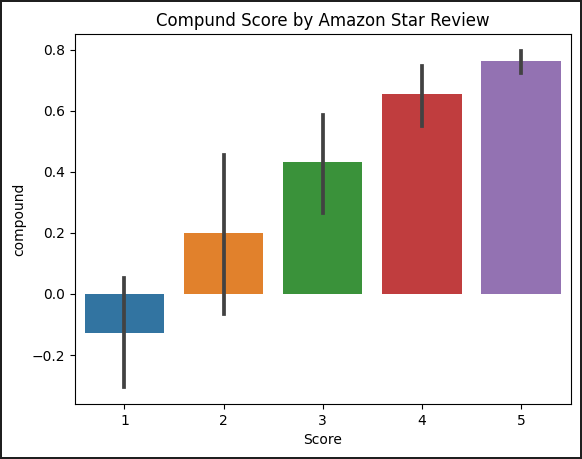
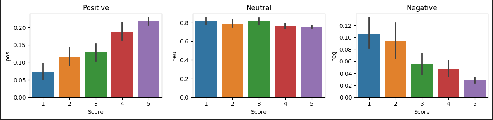

# 🛍️ Amazon Review Sentiment Analysis using ML & Transformers

This project explores sentiment analysis on Amazon product reviews using various machine learning techniques including:
- 🧠 Naive Bayes
- 💡 Support Vector Machines (SVM)
- 🤖 VADER Sentiment Intensity Analyzer
- 🔥 BERTweet Transformer for Deep Sentiment Classification

---

## 🧠 Models Implemented

### ✅ Traditional ML Approaches
- **Multinomial Naive Bayes**
  - With Bag of Words
  - With TF-IDF
- **Linear SVM**
  - With Bag of Words
  - With TF-IDF

### ✅ Sentiment Scoring
- **VADER** (Lexicon-based sentiment scoring)
- **BERTweet Transformer** via 🤗 HuggingFace Transformers

---

## 📦 Libraries Used

- `pandas`, `numpy`, `matplotlib`, `seaborn`
- `sklearn`, `nltk`
- `transformers`, `scipy`, `tqdm`

---

## 📁 Dataset

The dataset used is `Reviews.csv`, which includes Amazon product reviews and corresponding star scores (1-5).

---

## ⚙️ How It Works

1. **Preprocessing**:
   - Remove HTML tags, non-alphabet characters, and lowercase
   - Tokenization
   - Stopword removal & Lemmatization

2. **Modeling**:
   - Train/test split
   - Bag-of-Words and TF-IDF vectorization
   - Train and evaluate Naive Bayes and SVM models

3. **Sentiment Analysis**:
   - Apply VADER on all reviews
   - Predict with `bertweet-base-sentiment-analysis` transformer model

4. **Visualization**:
   - Bar plots comparing sentiment scores to star ratings

---

## 📊 Visualizations

### 🔹 Compound Score by Rating



### 🔹 Sentiment Breakdown



---

## 🧪 Sample Predictions

```python
"I love this product!" 
# → Positive (BERTweet)

"This item is okay, but not great." 
# → Neutral (VADER)

"Terrible experience, I want a refund!" 
# → Negative (Both)
```

## 🚀 How to Run Locally

### Clone the repository
git clone https://github.com/yourusername/amazon-sentiment-analysis.git
cd amazon-sentiment-analysis


### Install dependencies
pip install -r requirements.txt


### Run the notebook/script
python review_sentiment.py
